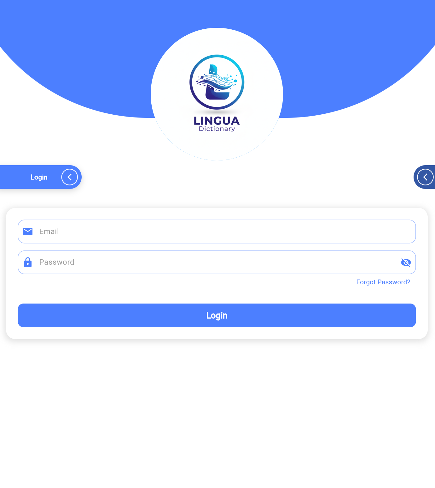
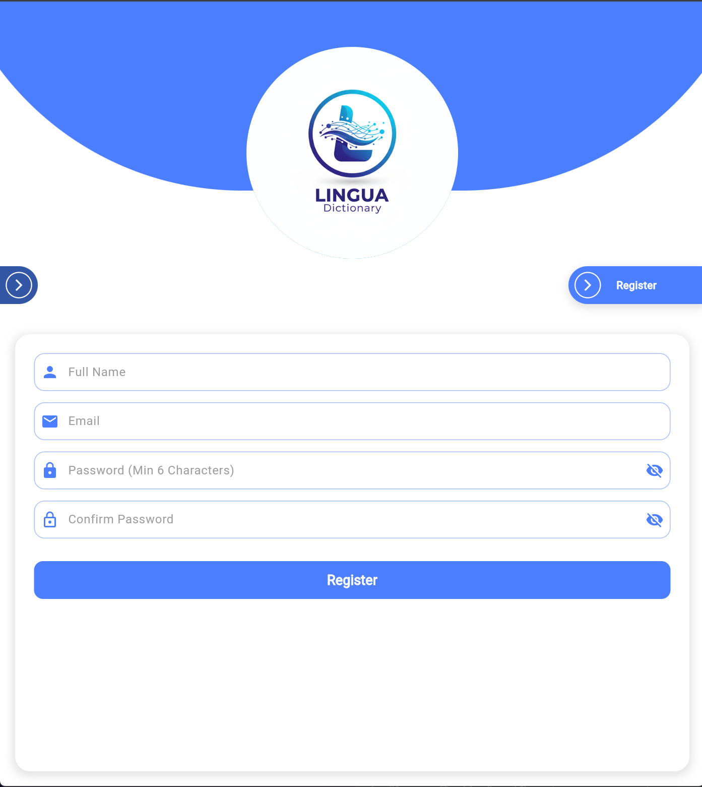
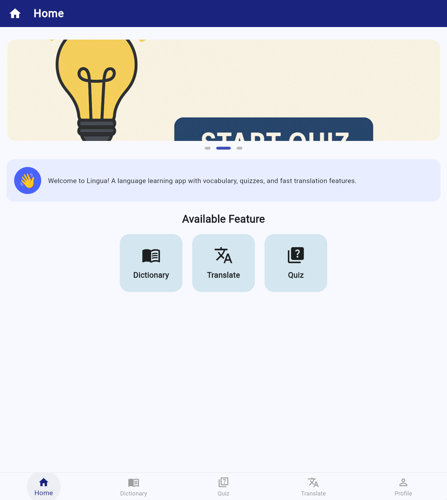
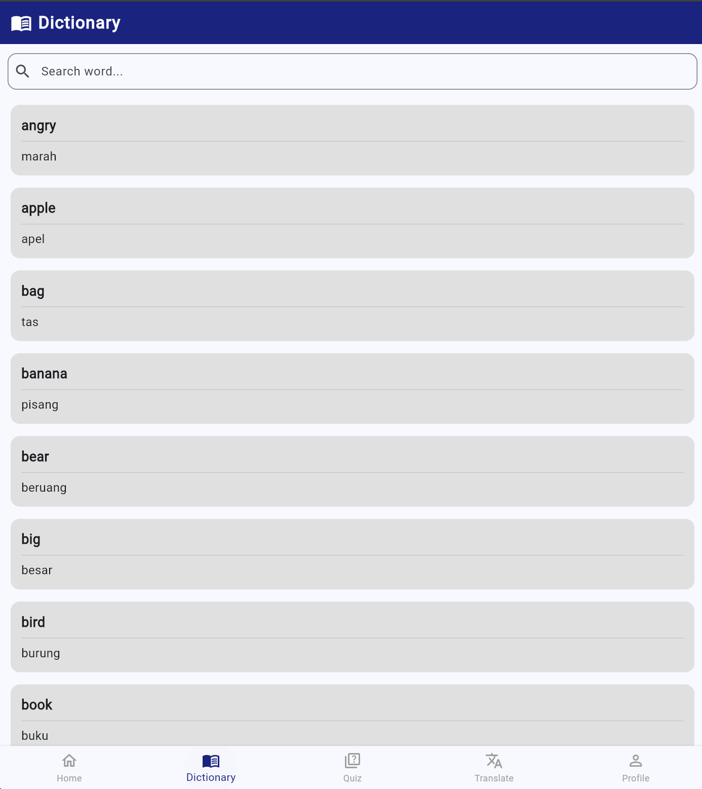
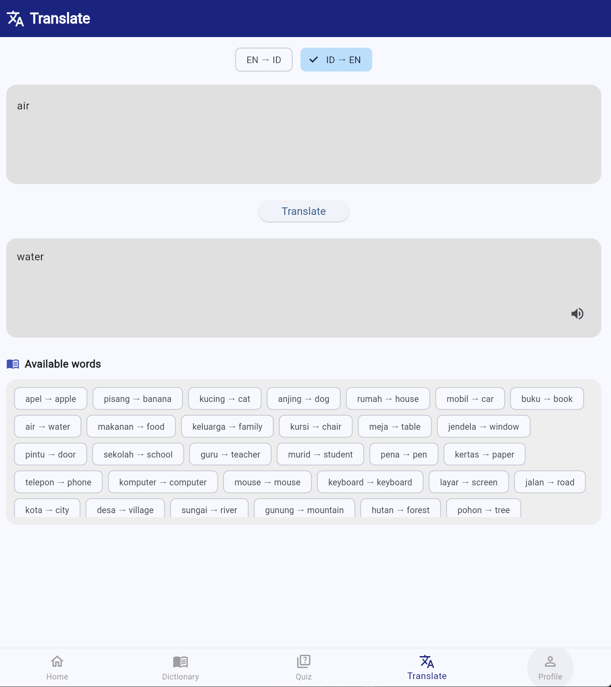
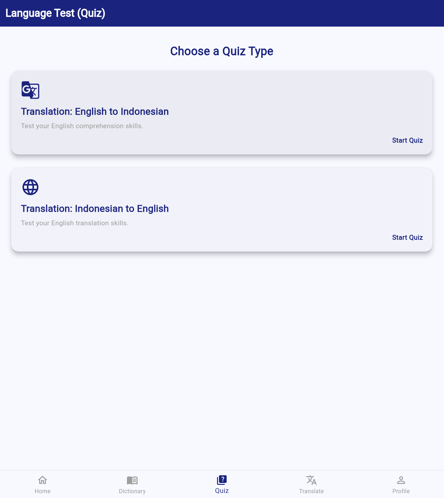
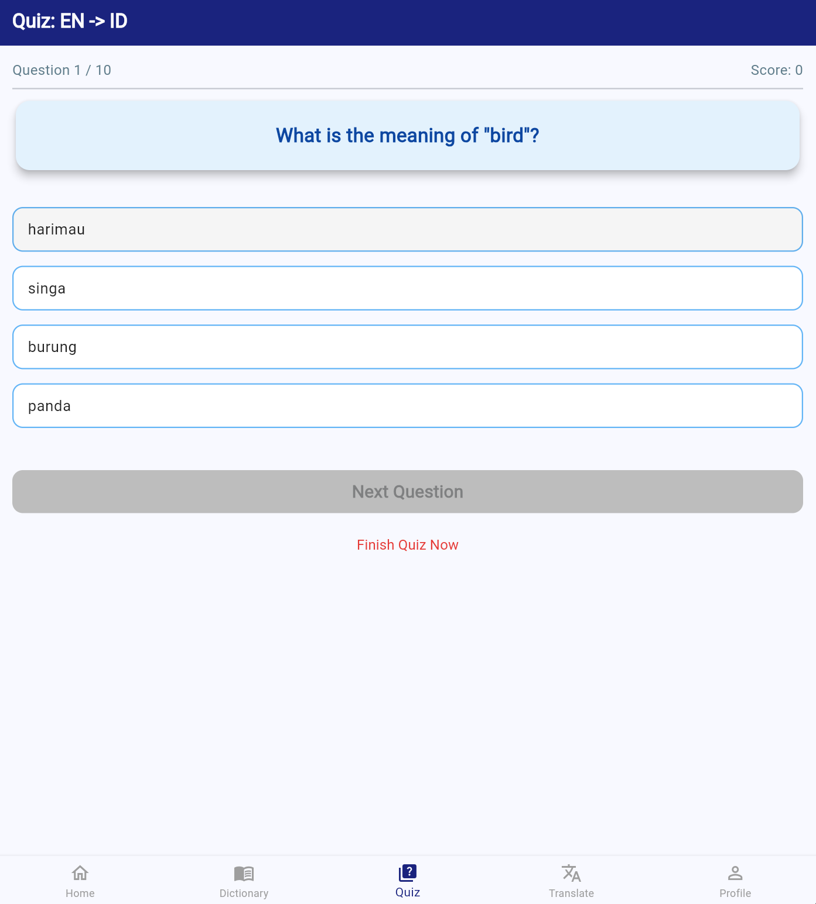
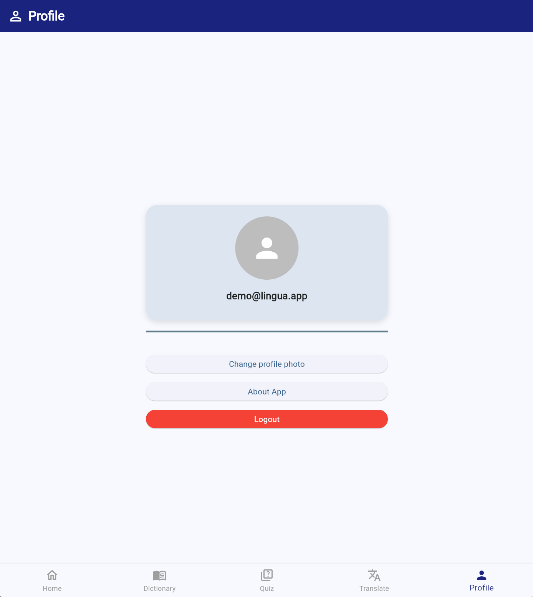

# 📖 Lingua

> A Flutter language learning app with a vocabulary dictionary, an English–Indonesian translator, and interactive quizzes.

## 📸 Screenshots

| Login | Register | Home |
|---|---|---|
|  |  |  |

| Dictionary | Translate | Quiz |
|---|---|---|
|  |  |  |

| Quiz Question | Profile |
|---|---|
|  |  |

---

## ✨ Features

- 🔐 **Authentication** — sign up, sign in, and password reset with role-based access (user / admin)
- 📖 **Vocabulary Dictionary** — browse everyday words with English–Indonesian translations and real-time search
- 🌐 **Translator** — translate text between English and Indonesian with text-to-speech and a list of available words
- 🧠 **Quizzes** — multiple-choice quizzes in both `EN → ID` and `ID → EN` directions with instant feedback
- 📊 **Score Tracking** — per-user quiz history and scores (admin can view all results)
- ⚙️ **Admin Panel** — manage quiz questions and view user scores (admin role)
- 🖼️ **Profile Photo** — set a profile photo from the gallery or camera (session only)

---

## 🛠️ Built With

- 🟣 **Flutter** — cross-platform UI framework (Dart)
- 🔥 **Firebase** — Authentication (Email/Password) and Realtime Database
- 🗣️ **flutter_tts** — text-to-speech for pronunciation
- 📷 **image_picker** — profile photo from gallery/camera

---

## 🔑 Demo Account

| Role | Email | Password | Access |
|---|---|---|---|
| User | `demo@lingua.app` | `demo123` | Browse dictionary, take quizzes, view own scores |

You can also register a new account from the **Register** 

---

## 🚀 Getting Started

### Option A - Install the APK (fastest)

Download `Lingua-v1.0.0.apk` from the [Releases](../../releases) section and install it on any Android device (Android 8.0+). The app connects to the project's Firebase backend.

### Option B - Run with VS Code

1. Install [Flutter](https://docs.flutter.dev/get-started/install) and the **Flutter** extension in VS Code
2. Open the project folder in VS Code: `File → Open Folder`
3. Connect an Android device (USB debugging) or start an Android emulator
4. Press `F5` (or the **Run ▸ Start Debugging** menu) with `lib/main.dart` open
5. Alternatively, run `flutter run` in the terminal
6. Create a new account from the **Register** screen (role: user)

> 💡 Lingua is fully cross-platform: Firebase is configured for **Android**, **Web**, **iOS**, and **macOS** (single project). On Android use an emulator/device; for the web version pick Chrome/Edge in VS Code (`flutter run -d chrome`).

### Option C - Build from the command line

```bash
flutter pub get
flutter run                       # run on a connected device/emulator
flutter build apk --release       # build the release APK
```

---

## 🗄️ Using Your Own Firebase Database

The app's Firebase credentials are **not committed** to this repository — they are injected at build time via `--dart-define` (see `lib/firebase_options.dart`). To point the app at **your own** Firebase backend:

**Option A — recommended (FlutterFire CLI):**

1. Install the CLI: `dart pub global activate flutterfire_cli`
2. Create a project at [Firebase Console](https://console.firebase.google.com/) and add an **Android app** with package name `com.codemelvin.lingua`
3. Run `flutterfire configure` from the project root and select your project — this regenerates `lib/firebase_options.dart` and `android/app/google-services.json` with your values
4. In **Authentication → Sign-in method**, enable **Email/Password**
5. In **Realtime Database**, create a database and apply the security rules from [`firebase.rules.json`](firebase.rules.json)
6. Optionally import the data (nodes: `language`, `quiz`, `accounts`, `user_scores`) or seed `language`/`quiz` yourself

**Option B — build-time environment variables:**

Pass your own project values when building:

```
flutter build apk --dart-define=FIREBASE_ANDROID_API_KEY=... --dart-define=FIREBASE_ANDROID_APP_ID=... --dart-define=FIREBASE_PROJECT_ID=... --dart-define=FIREBASE_DATABASE_URL=... --dart-define=FIREBASE_MESSAGING_SENDER_ID=...
```

(Web builds use `FIREBASE_WEB_API_KEY` / `FIREBASE_WEB_APP_ID` / `FIREBASE_WEB_MEASUREMENT_ID`.) This keeps credentials out of the source tree entirely — convenient for CI or hosting platforms like Vercel, where secrets live in environment variables.

> **Note:** `android/app/google-services.json`, `ios/Runner/GoogleService-Info.plist`, `macos/Runner/GoogleService-Info.plist`, and `firebase.json` are git-ignored and never pushed.

The security rules live in **`firebase.rules.json`** at the project root. They keep user data isolated: a user can only read and write their own account and score records, while the admin role is assigned manually in the Firebase Console. Users cannot promote themselves.

---

## 📁 Project Structure

```
lingua/
├── lib/
│   ├── constants.dart               # App constants (quiz app identifier)
│   ├── firebase_options.dart        # Firebase project configuration
│   ├── main.dart                    # Entry point & routes
│   ├── models/
│   │   ├── quiz_question.dart       # Quiz question model
│   │   └── quiz_result.dart         # Quiz result model
│   ├── services/
│   │   ├── dictionary_service.dart  # Dictionary & translation logic
│   │   └── quiz_service.dart        # Quiz fetch & result submission
│   └── screens/
│       ├── auth/                    # Slider, login, register, forgot password
│       ├── home/                    # Main dashboard
│       ├── dictionary/              # Vocabulary dictionary
│       ├── translate/               # Translator
│       ├── quiz/                    # Quiz player & question management
│       ├── profile/                 # Profile & logout
│       └── admin/                   # Admin dashboard & user scores
└── screenshots/                     # Screenshots used in this README
```

---

## 📝 License

This project is licensed under the MIT License — see the [LICENSE](LICENSE) file for details.

---

## 👤 Author

**Melvin** ([@CodeMelvin](https://github.com/CodeMelvin))
